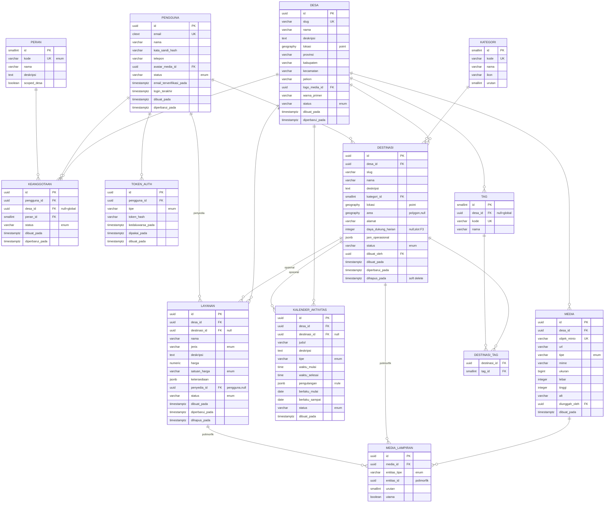

# ERD Fase 0 — Kiluan

**Cakupan:** modul **Gerbang** (Etalase & Discovery), **Balai Warga** (Identitas & Keanggotaan), **Destinasi Kiluan** (Basis Data Destinasi).
**Prinsip:** multi-tenant (scope per-desa) + RBAC sejak awal, agar replikasi di Fase 4 tidak perlu refactor. Slot untuk fase lanjut disiapkan tetapi tabelnya belum dibuat di F0.
**Target DBMS:** PostgreSQL 16 + PostGIS. Migrasi via Alembic.

---

## 1. Diagram ERD

---

## 2. Konvensi umum

- **PK:** UUID (disarankan **UUIDv7** agar terurut waktu → indeks lebih ramah). Tabel referensi kecil (`peran`, `kategori`, `tag`) memakai `smallint` serial.
- **Timestamp:** semua `timestamptz` (UTC). Kolom standar `dibuat_pada`, `diperbarui_pada`.
- **Soft delete:** kolom `dihapus_pada` (nullable) pada tabel konten (`destinasi`, `layanan`). Query publik selalu memfilter `dihapus_pada IS NULL`.
- **Tenant:** setiap tabel domain punya `desa_id`. **Tidak ada** query tanpa filter tenant. Opsi hardening: PostgreSQL **RLS** per-desa (lihat §6).
- **Email:** tipe `citext` (case-insensitive) + unik.
- **Enum:** dilakukan di level aplikasi (Pydantic) + `CHECK`/lookup, bukan `ENUM` native Postgres, agar mudah menambah nilai tanpa migrasi berat.
- **Naming:** snake_case Bahasa Indonesia, konsisten dengan blueprint.

---

## 3. Spesifikasi tabel

### 3.1 `desa` (tenant root)
Satu baris untuk Teluk Kiluan di F0; siap multi-baris di F4.
- `slug` unik (mis. `teluk-kiluan`) → dipakai di rute `/[desa]`.
- `lokasi` `geography(Point,4326)`; `logo_media_id`, `warna_primer` = seed branding (theming penuh di F4).
- `status`: `draft | aktif | nonaktif`.
- Indeks: `UNIQUE(slug)`.

### 3.2 `pengguna`
- `email` `citext UNIQUE`, `kata_sandi_hash` (argon2/bcrypt).
- `status`: `pending | aktif | nonaktif | tersuspensi`.
- `email_terverifikasi_pada`, `login_terakhir` nullable.
- Indeks: `UNIQUE(email)`.

### 3.3 `peran` (referensi RBAC)
Seed tetap. `kode`: `wisatawan | pokdarwis | umkm | agen | kontributor | organisasi | perangkat_desa | admin`.
- `scoped_desa` boolean: `true` = peran terikat desa (pokdarwis, umkm, agen, dst.); `false` = global (admin).

### 3.4 `keanggotaan` (jembatan pengguna × desa × peran)
Inti multi-tenant RBAC. Seorang pengguna bisa punya banyak peran di banyak desa.
- `desa_id` **nullable** (null = peran global seperti admin).
- `status`: `aktif | menunggu | ditolak | nonaktif` (pendaftaran pokdarwis/umkm perlu persetujuan).
- Indeks: `UNIQUE(pengguna_id, desa_id, peran_id)`; index `(desa_id, peran_id, status)`.

### 3.5 `token_auth`
Refresh token & tautan sekali-pakai.
- `tipe`: `penyegar | verifikasi_email | reset_sandi`.
- Simpan `token_hash` (bukan token mentah). Indeks `(pengguna_id, tipe)`, `kedaluwarsa_pada`.

### 3.6 `kategori` (taksonomi destinasi)
Global (lintas-desa) agar konsisten. Contoh: pantai, snorkeling, mangrove, budaya, kuliner.

### 3.7 `destinasi` (spot wisata)
- `lokasi` `geography(Point,4326)` **wajib**; `area` `geography(Polygon,4326)` opsional (zona konservasi/daya dukung).
- `daya_dukung_harian` **nullable** — slot untuk Jejak Lestari (F3); belum dipakai di F0.
- `jam_operasional` jsonb (mis. per hari).
- `status`: `draft | publikasi | arsip`.
- Indeks: `UNIQUE(desa_id, slug)`; **GIST** pada `lokasi` dan `area`; index `(desa_id, status, kategori_id)`.

### 3.8 `layanan`
Layanan dasar F0 (transportasi, pemandu, penginapan, sewa alat, kuliner, tiket).
- `jenis` **enum** (bukan FK kategori) karena menggerakkan logika booking di F2: `transportasi | pemandu | penginapan | sewa_alat | kuliner | tiket_masuk | lainnya`.
- `satuan_harga`: `per_orang | per_paket | per_malam | per_unit | per_jam`.
- `penyedia_id` → `pengguna` (nullable). **Slot F1:** kolom `umkm_id` ditambahkan saat modul Pasar Desa hadir.
- `ketersediaan` jsonb (kuota/jadwal sederhana; diperketat di F2).
- Indeks: `(desa_id, status, jenis)`, `(destinasi_id)`.

### 3.9 `kalender_aktivitas`
Event/musiman/harian (mis. "lumba-lumba pagi" harian 05:30–07:00).
- `tipe`: `harian | musiman | event`.
- `pengulangan` jsonb (pola RRULE-like); `berlaku_mulai/sampai` untuk musiman.

### 3.10 `media`
Referensi objek MinIO.
- `objek_minio` (key) unik; `url` turunan; `tipe`: `foto | video`.
- Metadata: `mime, ukuran, lebar, tinggi, alt`.

### 3.11 `media_lampiran` (polimorfik)
Menghubungkan `media` ke banyak jenis entitas tanpa FK nullable berantakan.
- `entitas_tipe`: `destinasi | layanan | desa | pengguna`.
- `entitas_id`: UUID entitas terkait (tanpa FK keras — dijaga di aplikasi).
- `urutan`, `utama` (foto sampul). Indeks `(entitas_tipe, entitas_id)`.

### 3.12 `tag` & `destinasi_tag`
Faset pencarian ringan di Gerbang (mis. "ramah keluarga", "spot foto"). `tag.desa_id` nullable (global/lokal). `destinasi_tag` PK gabungan `(destinasi_id, tag_id)`.

---

## 4. Daftar enum (F0)

| Kolom | Nilai |
|---|---|
| `desa.status` | draft, aktif, nonaktif |
| `pengguna.status` | pending, aktif, nonaktif, tersuspensi |
| `peran.kode` | wisatawan, pokdarwis, umkm, agen, kontributor, organisasi, perangkat_desa, admin |
| `keanggotaan.status` | aktif, menunggu, ditolak, nonaktif |
| `token_auth.tipe` | penyegar, verifikasi_email, reset_sandi |
| `destinasi.status` | draft, publikasi, arsip |
| `layanan.jenis` | transportasi, pemandu, penginapan, sewa_alat, kuliner, tiket_masuk, lainnya |
| `layanan.satuan_harga` | per_orang, per_paket, per_malam, per_unit, per_jam |
| `layanan.status` | draft, publikasi, arsip |
| `kalender_aktivitas.tipe` | harian, musiman, event |
| `kalender_aktivitas.status` | aktif, nonaktif |
| `media.tipe` | foto, video |
| `media_lampiran.entitas_tipe` | destinasi, layanan, desa, pengguna |

---

## 5. Multi-tenant & RBAC

- **Resolusi tenant:** dari `slug` desa di URL → `desa_id`. Semua service menerima `desa_id` dan wajib memfilternya.
- **Otorisasi:** cek `keanggotaan` aktif (`pengguna_id`, `desa_id`, `peran`) untuk aksi tertulis. Peran global (`admin`, `desa_id=null`) melewati scope.
- **Pola izin:** definisikan matriks `(peran × aksi × modul)` di aplikasi. Contoh F0: hanya `pokdarwis`/`perangkat_desa`/`admin` boleh `publikasi` destinasi; `wisatawan` hanya baca.

## 6. Catatan implementasi

- **PostGIS:** aktifkan ekstensi di migrasi awal; SRID 4326; GIST index untuk query radius (`ST_DWithin`).
- **RLS opsional (hardening):** aktifkan Row-Level Security per-desa pada tabel domain agar kebocoran lintas-tenant tercegah di level DB, bukan hanya aplikasi. Tradeoff: menambah kompleksitas koneksi (set `app.desa_id` per request). Rekomendasi: mulai di aplikasi, aktifkan RLS sebelum go-live publik.
- **Seed data:** `peran` (8 baris), `kategori` awal, `desa` Teluk Kiluan, akun `admin` pertama.
- **Alembic:** satu migrasi bootstrap (ekstensi + seluruh tabel F0 + seed referensi).

## 7. Batas F0 (yang BELUM dibuat — sengaja)

Ditambahkan pada fasenya masing-masing agar F0 tetap ramping:
- **F1:** `umkm`, `produk_jasa`, `paket_wisata`, `kontribusi`, `kurasi_log`, `poin`, `badge`, `aturan_gamifikasi`, + kolom `layanan.umkm_id`, seed `kartu_aksi`/`sertifikasi_owner` (Naik Kelas Lestari).
- **F2:** `booking`, `transaksi` (+ hook porsi reinvestment), `misi`, `paspor_lestari`, `stempel`, `stasiun_lestari`, `verifikasi`.
- **F3:** `monitoring_ekologi`, `daya_dukung` (mengaktifkan `destinasi.daya_dukung_harian`), `dana_konservasi`, `neraca_regeneratif`, agregat medallion DuckDB.
- **F4:** tabel provisioning/tema per-desa untuk white-label.

---

## 8. Gerbang `pytest` untuk F0

- Migrasi bootstrap jalan bersih + rollback.
- `UNIQUE` bekerja: slug desa, email pengguna, `(desa_id, slug)` destinasi, keanggotaan.
- RBAC menolak aksi lintas-tenant & peran tak berwenang.
- Query radius PostGIS mengembalikan spot dalam jarak benar.
- Lampiran media polimorfik terhubung & `utama` tunggal per entitas.
- Soft delete menyembunyikan destinasi/layanan dari endpoint publik.
