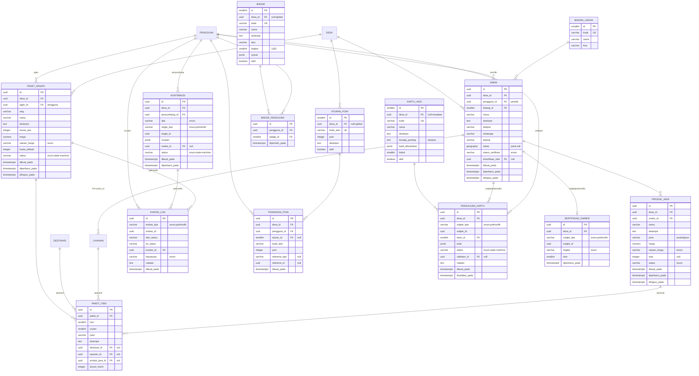

# ERD Fase 1 — Kiluan

**Cakupan:** **Pasar Desa** (Kolaborasi Ekosistem: UMKM, produk/jasa, paket wisata) · **Dapur Konten** (Kurasi: kontribusi + state machine) · **Lencana Warga** (Gamifikasi: poin & badge) · **seed Misi Kiluan** sisi owner (*Naik Kelas Lestari*).
**Bergantung pada F0:** `desa`, `pengguna`, `peran`, `keanggotaan`, `destinasi`, `layanan`, `media`, `media_lampiran`.
**Prinsip tetap:** multi-tenant per-desa, RBAC, soft delete pada konten, enum di level aplikasi + CHECK.

---

## 1. Diagram ERD



---

## 2. Perubahan pada tabel F0 (ALTER)

- `layanan` **+ `umkm_id` UUID FK → umkm** (nullable; penyedia layanan bisa berupa UMKM). Slot ini sudah diantisipasi di ERD F0 §7.
- `media_lampiran.entitas_tipe` **+ nilai enum**: `umkm`, `produk_jasa`, `paket_wisata`, `kontribusi`.

---

## 3. Spesifikasi tabel

### 3.1 `bidang_usaha` (lookup)
Klasifikasi UMKM untuk filter Pasar Desa: kuliner, kerajinan, homestay, jasa_wisata, hasil_laut, dll. Global.

### 3.2 `umkm`
- `pengguna_id` = akun pemilik (peran `umkm` di `keanggotaan`).
- `status_verifikasi`: `menunggu | terverifikasi | ditolak`. **Hanya UMKM terverifikasi** yang produknya bisa `publikasi`.
- `lokasi` PostGIS point (opsional). `diverifikasi_oleh` → pengguna (pokdarwis/perangkat_desa/admin).
- Indeks: `(desa_id, status_verifikasi, bidang_id)`; GIST `lokasi`.

### 3.3 `produk_jasa`
- `jenis`: `produk | jasa`. `satuan_harga` sama seperti F0.
- `status`: `draft | publikasi | arsip`. `stok` nullable (jasa tak berstok).
- Media via `media_lampiran(entitas_tipe='produk_jasa')`.
- Indeks: `(desa_id, umkm_id, status)`.

### 3.4 `paket_wisata`
- `agen_id` = pengguna berperan `agen`.
- `status` = **state machine** (lihat §5): `draft | review | publikasi | ditolak | arsip`.
- `kuota_default` = kuota dasar; penjadwalan per-tanggal & kuota harian dibuat di **F2** (booking).
- Indeks: `UNIQUE(desa_id, slug)`; `(desa_id, status)`.

### 3.5 `paket_item` (komponen itinerary)
Menyusun paket dari destinasi/layanan/produk. `hari` + `urutan` mengurutkan itinerary. Tiga FK opsional (`destinasi_id`, `layanan_id`, `produk_jasa_id`) — minimal satu terisi atau item bebas (judul+deskripsi). Indeks `(paket_id, hari, urutan)`.

### 3.6 `kontribusi`
Crowdsourcing data.
- `tipe`: `foto | tips | koreksi_data | spot_baru | ulasan`.
- `target_tipe` (polimorfik): `destinasi | layanan | umkm | paket_wisata | desa`; `target_id` UUID.
- `muatan` jsonb (teks/tips/usulan koreksi); `media_id` untuk sumbangan foto.
- `status` = **state machine** (§5): `menunggu | disetujui | ditolak | revisi`.
- Indeks: `(desa_id, status)`, `(target_tipe, target_id)`.

### 3.7 `kurasi_log` (audit transisi — generic)
Jejak keputusan kurasi untuk semua entitas yang dikurasi.
- `entitas_tipe`: `kontribusi | paket_wisata | produk_jasa | umkm | pengajuan_kartu`.
- `keputusan`: `setuju | tolak | minta_revisi | ajukan`.
- Menyimpan `dari_status`/`ke_status` + `catatan`. Append-only. Indeks `(entitas_tipe, entitas_id)`.

### 3.8 `aturan_poin`
Aturan pemberian poin. Contoh `kode_aksi`: `kontribusi_disetujui`, `produk_terdaftar`, `paket_dipublikasi`, `profil_lengkap`, `warga_perintis`. `desa_id` null = berlaku global.

### 3.9 `transaksi_poin` (ledger, append-only)
Saldo = `SUM(poin)` per `(pengguna_id, desa_id)`.
- **Idempotensi wajib:** `UNIQUE(pengguna_id, kode_aksi, referensi_tipe, referensi_id)` mencegah double-award (mis. kontribusi yang sama disetujui dua kali).
- Indeks: `(desa_id, pengguna_id)`, `(desa_id, dibuat_pada)` untuk leaderboard.

### 3.10 `badge` & `badge_pengguna`
- `badge.tingkat`: 3 tingkat (1/2/3). `syarat` jsonb (mis. `{"poin_min":100}` atau `{"aksi":"kontribusi_disetujui","jumlah":10}`).
- `badge_pengguna`: `UNIQUE(pengguna_id, badge_id)`; award idempoten.

### 3.11 `kartu_aksi` (seed Naik Kelas Lestari)
Definisi praktik regeneratif. `desa_id` null = template baku, bisa dikustom per-desa.
- `kenapa_penting` = modul edukasi singkat (owner belajar).
- `bukti_dibutuhkan` jsonb (mis. `{"foto":true,"dokumen":false,"pernyataan":true}`).
- `bobot` = kontribusi ke skor tingkat.

### 3.12 `pengajuan_kartu`
Owner mengajukan kartu + bukti.
- `subjek_tipe` (polimorfik): `umkm | agen | pokdarwis`; `subjek_id` → umkm.id atau pengguna.id.
- `status` = **state machine** (§5): `menunggu | tervalidasi | ditolak | revisi`.
- Validasi manual oleh `perangkat_desa`/`pokdarwis` di F1; loop verifikasi berbukti penuh (QR/monitoring) menyusul di **F3**.
- Indeks: `(desa_id, subjek_tipe, subjek_id)`, `(status)`.

### 3.13 `sertifikasi_owner`
Tingkat terkini owner (turunan dari kartu tervalidasi, disimpan agar sort ranking cepat).
- `tingkat`: `tunas | bahari | lumba_lumba`. `skor` = Σ bobot kartu tervalidasi.
- `UNIQUE(desa_id, subjek_tipe, subjek_id)`.

---

## 4. Enum F1

| Kolom | Nilai |
|---|---|
| `umkm.status_verifikasi` | menunggu, terverifikasi, ditolak |
| `produk_jasa.jenis` | produk, jasa |
| `produk_jasa.status` | draft, publikasi, arsip |
| `paket_wisata.status` | draft, review, publikasi, ditolak, arsip |
| `kontribusi.tipe` | foto, tips, koreksi_data, spot_baru, ulasan |
| `kontribusi.target_tipe` | destinasi, layanan, umkm, paket_wisata, desa |
| `kontribusi.status` | menunggu, disetujui, ditolak, revisi |
| `kurasi_log.entitas_tipe` | kontribusi, paket_wisata, produk_jasa, umkm, pengajuan_kartu |
| `kurasi_log.keputusan` | setuju, tolak, minta_revisi, ajukan |
| `pengajuan_kartu.subjek_tipe` | umkm, agen, pokdarwis |
| `pengajuan_kartu.status` | menunggu, tervalidasi, ditolak, revisi |
| `sertifikasi_owner.tingkat` | tunas, bahari, lumba_lumba |

---

## 5. State machine (kunci F1)

**`paket_wisata.status`** (agen membuat; pokdarwis/admin mengurasi):
```
draft ──(ajukan)──► review ──(setuju)──► publikasi ──(arsip)──► arsip
  ▲                    │
  └──(minta_revisi)────┘   review ──(tolak)──► ditolak
```

**`kontribusi.status`**:
```
menunggu ──(setuju)──► disetujui   (→ award poin + terapkan ke target)
menunggu ──(tolak)──► ditolak
menunggu ──(minta_revisi)──► revisi ──(kirim ulang)──► menunggu
```

**`pengajuan_kartu.status`**:
```
menunggu ──(validasi)──► tervalidasi   (→ hitung ulang sertifikasi_owner)
menunggu ──(tolak)──► ditolak
menunggu ──(minta_revisi)──► revisi ──(kirim ulang)──► menunggu
```

Aturan: transisi ilegal ditolak service; setiap transisi menulis satu baris `kurasi_log`.

---

## 6. Mekanika turunan

**Gamifikasi.** Award poin dipicu event domain (mis. `kontribusi→disetujui`). Service menulis `transaksi_poin` dengan `referensi_tipe/id` unik → idempoten. Setelah award, evaluasi `badge.syarat`; jika terpenuhi & belum dimiliki → insert `badge_pengguna`. **Leaderboard** = query agregat `transaksi_poin` per desa (materialized view opsional bila trafik tinggi).

**Naik Kelas Lestari.** Saat `pengajuan_kartu→tervalidasi`: hitung `skor = Σ bobot kartu tervalidasi` untuk subjek → tentukan `tingkat` via ambang konfigurable (mis. Tunas ≥ s1, Bahari ≥ s2 + kartu wajib tertentu, Lumba-Lumba ≥ s3) → upsert `sertifikasi_owner`. **Boost ranking Pasar Desa:** urutan listing `produk_jasa`/`umkm` = fungsi (`tingkat` desc, rating, kebaruan). `tingkat` disimpan agar sort murah & auditable lewat riwayat `pengajuan_kartu` + `kurasi_log`.

---

## 7. Batas F1 (belum dibuat — sengaja)

- **F2:** `booking`, `paket_jadwal` (kuota per-tanggal), `transaksi` (+ hook reinvestment), sisi wisatawan Misi Kiluan (`misi`, `paspor_lestari`, `stempel`, `stasiun_lestari`, `verifikasi`).
- **F3:** `monitoring_ekologi`, `daya_dukung`, `dana_konservasi`, `neraca_regeneratif`; verifikasi berbukti mengganti validasi manual `pengajuan_kartu`.
- **F4:** provisioning & tema per-desa.

---

## 8. Gerbang `pytest` F1

- State machine menolak transisi ilegal (mis. `draft→publikasi` langsung); tiap transisi menulis `kurasi_log`.
- Poin idempoten: menyetujui kontribusi yang sama dua kali hanya memberi poin sekali (uji unik `referensi`).
- Badge ter-award saat syarat terpenuhi, tak berganda.
- UMKM belum terverifikasi tidak bisa mem-publikasi produk.
- `pengajuan_kartu→tervalidasi` menaikkan `skor` & meng-upsert `tingkat` sesuai ambang.
- Ranking Pasar Desa mengurutkan sesuai `sertifikasi_owner.tingkat`.
- Semua query domain terfilter `desa_id` (tak ada kebocoran lintas-tenant).
- `paket_item` menolak item tanpa referensi maupun judul.
