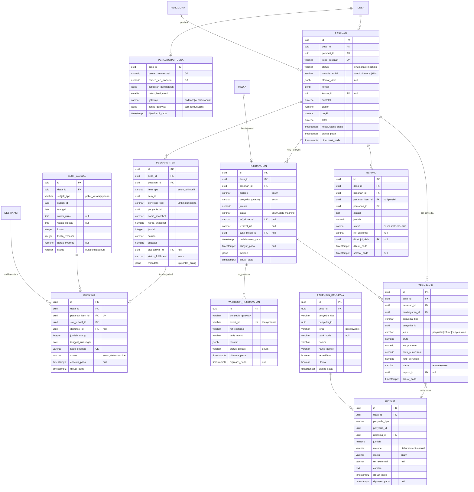
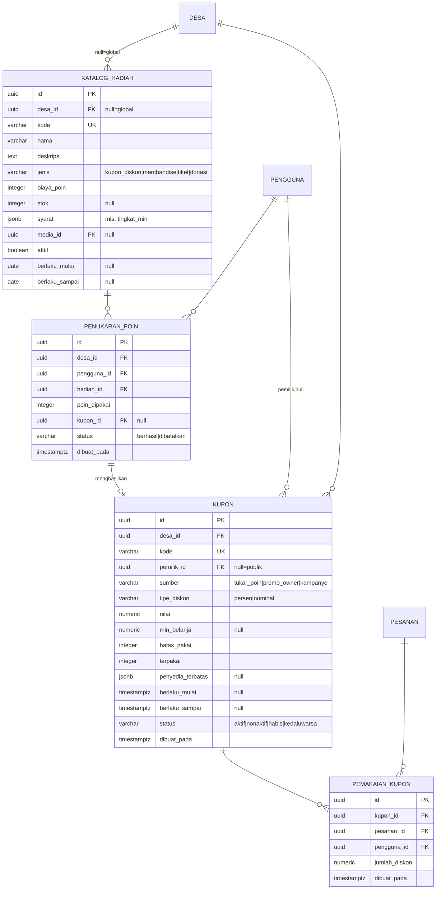
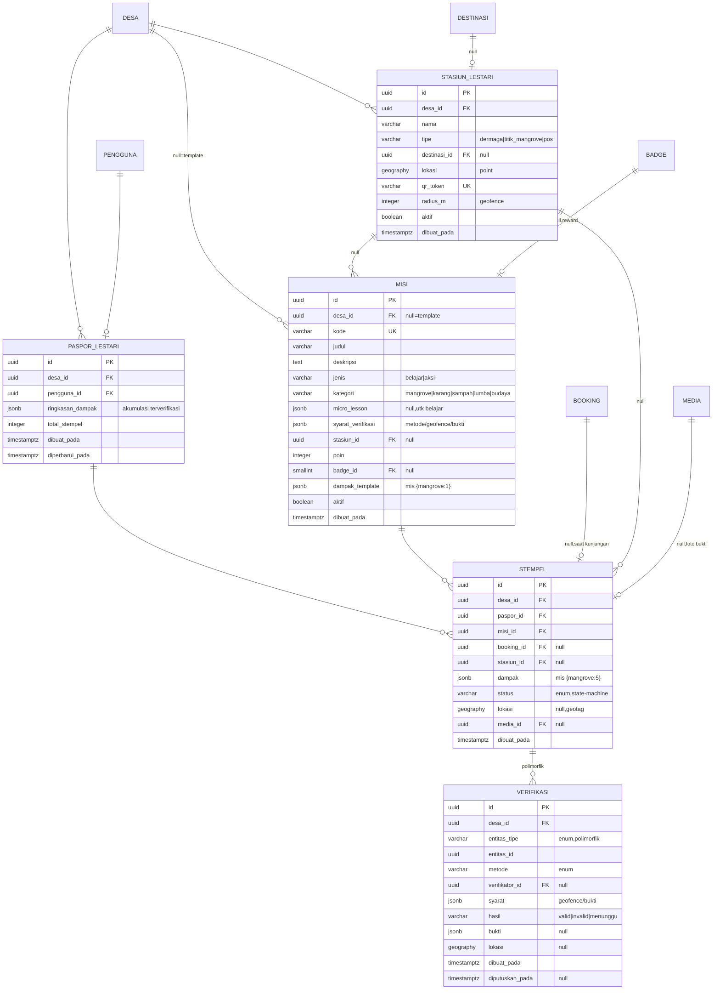
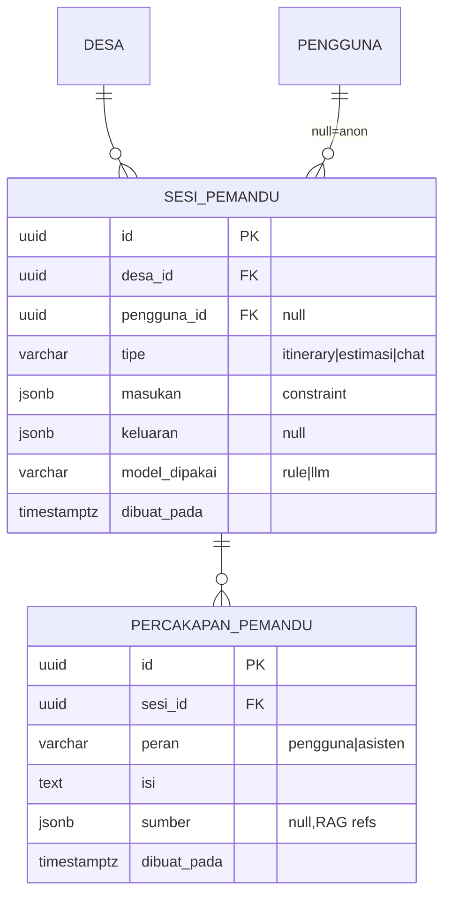

# ERD Fase 2 — Kiluan (Revisi: commerce escrow)

**Cakupan:** **Dermaga** (Pemesanan & Transaksi: pesanan generik, jadwal & booking, **pembayaran escrow via gateway Indonesia**, ledger transaksi, payout, refund, kupon & tukar-poin) · **Pemandu** (AI Tourism Assistant rule-based) · **Penjelajah Lestari** (Misi Kiluan sisi wisatawan: misi, Paspor, Stempel, Stasiun) + tabel generik **`verifikasi`** (lahir di F2).
**Bergantung pada F0–F1:** `desa`, `pengguna`, `keanggotaan`, `destinasi`, `layanan`, `produk_jasa`, `paket_wisata`, `paket_item`, `umkm`, `media`, `transaksi_poin`, `badge`, `pengajuan_kartu`, `sertifikasi_owner`.
**Menyiapkan F3:** `transaksi.porsi_reinvestasi` → inflow `dana_konservasi`; `transaksi.neto_penyedia` → distribusi pendapatan Neraca; `booking` → `pemakaian_kapasitas`; `stempel`+`verifikasi` → validasi silang anti-greenwashing.
**Prinsip tetap:** multi-tenant per-`desa_id`, ledger uang **append-only**, enum di aplikasi + CHECK, idempotensi wajib pada uang & poin.

> **Revisi vs draft blueprint.** Blueprint menyinggung `booking` + `transaksi` sederhana (asumsi bayar manual). Keputusan **escrow via gateway Indonesia (ADR-02, §8)** menaikkan cakupan pembayaran: `pesanan` menggeneralisasi barang+jasa, `transaksi` jadi ledger per-penyedia dengan split, ditambah `pembayaran`, `webhook_pembayaran`, `payout`, `rekening_penyedia`, `refund`, serta lapisan kupon/tukar-poin. **Rancang penuh sekarang, aktifkan bertahap** (tahap 1 PkM = jalur manual + QRIS statis; disbursement/refund otomatis menyusul) — pola yang sama dengan "tenant sejak F0".

---

## 1a. Diagram — Dermaga (commerce + escrow)



## 1b. Diagram — Kupon & Tukar Poin



## 1c. Diagram — Penjelajah Lestari (Misi Kiluan wisatawan) + Verifikasi



## 1d. Diagram — Pemandu (AI, ringan)



---

## 2. Perubahan lintas-fase

- **Baru: `pengaturan_desa`** (1-1 `desa`) lahir di F2 — persen reinvestasi, fee platform, kebijakan pembatalan, `gateway`/`konfig_gateway`. F4 memperluas dengan `bahasa`/`zona_waktu`/`status_go_live`.
- `paket_wisata.kuota_default` (F1) → dimaterialisasi per tanggal lewat **`slot_jadwal`**; `layanan` berjadwal (mis. perahu lumba-lumba) juga memakai slot.
- `produk_jasa.stok` (F1) dipotong saat `pesanan` **dibayar** (bukan saat masuk keranjang); barang tak berjadwal → tanpa `booking`.
- `transaksi_poin` (F1, append-only) menampung **redeem** lewat baris **poin negatif** (`kode_aksi='tukar_hadiah'`, `referensi_tipe='penukaran_poin'`) — memakai `UNIQUE(pengguna, kode_aksi, referensi_tipe, referensi_id)` yang sudah ada untuk idempotensi. **Tak perlu ledger poin baru.**
- **`verifikasi`** lahir di F2 (`entitas_tipe`: `stempel`, `pengajuan_kartu`). F3 memperluasnya ke `monitoring_ekologi`. Ini titik di mana validasi `pengajuan_kartu` (F1, manual) mulai bisa berbasis bukti.
- **Keranjang (cart) transient** di client/Redis — bukan tabel. `pesanan` dibuat saat checkout. Tradeoff: keranjang tak lintas-perangkat kecuali disinkron via Redis per-pengguna; cukup untuk F2.

---

## 3. Spesifikasi tabel

### Dermaga — commerce

**`pengaturan_desa`** — sumber kebenaran parameter uang per desa. `persen_reinvestasi` menentukan `transaksi.porsi_reinvestasi`; `batas_hold_menit` mengatur `pesanan.kedaluwarsa_pada` (lepas kuota bila tak dibayar). `konfig_gateway` menyimpan id sub-account/split rule (§8). **Blocker non-teknis:** `persen_reinvestasi` & tata kelola dana escrow **wajib disepakati FGD dengan Pokdarwis/perangkat desa sebelum go-live** (guardrail reinvestment loop).

**`pesanan`** (order header) — satu checkout, boleh multi-item & **multi-penyedia**. `kode_pesanan` human-readable unik. `total = subtotal − diskon + ongkir`. `metode_ambil` membedakan oleh-oleh `ambil_ditempat` vs `kirim` (`alamat_kirim` jsonb). State machine §5. Indeks `(desa_id, status, dibuat_pada)`, `(pembeli_id)`.

**`pesanan_item`** — baris polimorfik. `item_tipe`: `produk_jasa | paket_wisata | layanan | tiket_masuk`. **Snapshot** `nama_snapshot`/`harga_snapshot` membekukan harga saat checkout (histori tak berubah bila katalog berubah). `penyedia_tipe/penyedia_id` menentukan penerima payout. `status_fulfillment`: `menunggu | disiapkan | dikirim | diterima | diambil | batal` (relevan barang fisik; jasa memakai `booking`). `slot_jadwal_id` diisi bila item berjadwal. Indeks `(pesanan_id)`, `(penyedia_tipe, penyedia_id)`.

**`slot_jadwal`** — kuota per tanggal untuk subjek berjadwal (`paket_wisata`/`layanan`). `kuota_terpakai` counter dijaga **row lock** saat checkout (§6, anti-overbook). `harga_override` opsional (mis. harga akhir pekan). `UNIQUE(subjek_tipe, subjek_id, tanggal, waktu_mulai)`. `status` `penuh` diset otomatis saat `kuota_terpakai = kuota`.

**`booking`** — reservasi berjadwal, **1-1 dengan `pesanan_item` berjadwal** (`UNIQUE(pesanan_item_id)`). Memegang `slot_jadwal_id`, `destinasi_id` (untuk daya dukung F3, nullable karena paket bisa multi-destinasi), `jumlah_orang`, `kode_checkin` (QR tiket). State machine §5. **Sumber `pemakaian_kapasitas` F3** = booking `terkonfirmasi`+`checkin` per `(destinasi_id, tanggal_kunjungan)`.

**`pembayaran`** — satu upaya bayar untuk satu pesanan; retry → banyak baris, maksimal satu `berhasil`. `metode`: `qris | va_bank | ewallet | kartu | transfer_manual`. `penyedia_gateway`: `midtrans | xendit | manual`. `ref_eksternal` = id transaksi gateway (unik per gateway). `bukti_media_id` untuk `transfer_manual` (foto bukti transfer). `mentah` menyimpan payload gateway untuk audit. **Escrow: dana masuk akun/sub-account escrow platform, bukan langsung penyedia.** State machine §5.

**`webhook_pembayaran`** — log callback gateway. `event_id` **UNIQUE** memberi idempotensi tepat-sekali (gateway kerap mengirim ulang). `status_proses`: `diterima | diproses | diabaikan | gagal`. Kanal kebenaran status bayar adalah webhook + verifikasi status (bukan redirect klien).

**`transaksi`** — **ledger settlement append-only, granular per penyedia** (satu pesanan multi-penyedia → banyak baris). Split: `bruto` (Σ item penyedia) → `fee_platform` (dari `persen_fee_platform`; rendah/0 — community-owned, **bukan** take-rate OTA) + `porsi_reinvestasi` (dari `persen_reinvestasi`, ke dana konservasi F3) + `neto_penyedia` (dipayout). `jenis`: `penjualan | refund | penyesuaian`; refund = **baris baru negatif**, tak pernah update. `status` escrow §5. `payout_id` diisi saat masuk pencairan. Indeks `(desa_id, dibuat_pada)`, `(penyedia_tipe, penyedia_id, status)`, `(pesanan_id)`.

**`payout`** — pencairan escrow → penyedia (batch: banyak `transaksi` `dirilis` → satu payout). `metode`: `disbursement` (API gateway, mis. Xendit Disbursement/Midtrans Iris) atau `manual` (transfer bendahara Pokdarwis, tahap 1 PkM). `ref_eksternal` = id disbursement. Indeks `(desa_id, status)`, `(penyedia_tipe, penyedia_id)`.

**`rekening_penyedia`** — tujuan payout (`bank`/`ewallet`). `utama` tunggal per penyedia; `terverifikasi` sebelum bisa dipayout. Data sensitif — akses terbatas & tak pernah keluar ke publik.

**`refund`** — permohonan & proses refund (penuh/parsial via `pesanan_item_id`). State machine §5. Menghasilkan `transaksi(jenis=refund)` + entri pembayaran refund gateway. **Kebijakan escrow:** refund penuh mudah **sebelum** `payout`; sesudah dirilis → clawback rumit, jadi default kebijakan = refund hanya sebelum status `selesai`/payout (sisanya jalur manual bendahara). Ini tradeoff sadar demi kesederhanaan tahap 1.

### Dermaga — kupon & tukar poin

**`katalog_hadiah`** — item yang bisa ditukar poin. `jenis`: `kupon_diskon | merchandise | tiket | donasi`. `biaya_poin` + `stok` (null=tak terbatas, mis. kupon). `syarat` jsonb (mis. `{"tingkat_min":"bahari"}`). `desa_id` null = hadiah global.

**`penukaran_poin`** — event redeem. Guard: **saldo poin** (`SUM(transaksi_poin.poin)` per `(pengguna, desa)`) `>= biaya_poin` dengan lock → cegah saldo minus/double-spend. Menulis `transaksi_poin` negatif + (bila `kupon_diskon`) menerbitkan `kupon`. Indeks `(desa_id, pengguna_id)`.

**`kupon`** — voucher diskon. `sumber`: `tukar_poin | promo_owner | kampanye`. `pemilik_id` null = kupon publik. `penyedia_terbatas` jsonb membatasi ke penyedia tertentu — inilah kanal **"diskon dari UMKM bersertifikat"** (mis. `{"tingkat":"lumba_lumba"}` atau daftar `umkm_id`), menutup flywheel Misi Kiluan. `tipe_diskon` `persen|nominal`, `min_belanja`, `batas_pakai`/`terpakai`. `kode` UNIQUE.

**`pemakaian_kupon`** — log & idempotensi. `UNIQUE(kupon_id, pesanan_id)` cegah pakai ganda pada satu pesanan; increment `kupon.terpakai` atomik.

### Penjelajah Lestari + Verifikasi

**`misi`** — quest. `jenis`: `belajar` (buka `micro_lesson` wajib — edukasi kode etik lumba/karang/sampah) → membuka `aksi`. `syarat_verifikasi` jsonb (metode, geofence, bukti). `stasiun_id` titik aksi. `dampak_template` menormalkan dampak per penyelesaian. `desa_id` null = template. Reward: `poin` + `badge_id` (F1) + kupon (via katalog).

**`stasiun_lestari`** — titik QR fisik. `qr_token` UNIQUE (dirotasi berkala), `radius_m` geofence untuk validasi lokasi. `lokasi` PostGIS point.

**`paspor_lestari`** — impact passport, `UNIQUE(desa_id, pengguna_id)`. `ringkasan_dampak` = akumulasi **hanya stempel terverifikasi** ("kamu bantu tanam 5 mangrove, kurangi 2 kg sampah").

**`stempel`** — bukti penyelesaian misi. `dampak` jsonb aktual (mis. `{mangrove:5}`). `status` state machine §5, divalidasi lewat `verifikasi`. `booking_id` menautkan aksi ke kunjungan; `stasiun_id`+`lokasi` geotag untuk geofence. **Hanya `terverifikasi` yang masuk `paspor` & (F3) `neraca_regeneratif`.**

**`verifikasi`** (generik, polimorfik) — `entitas_tipe`: `stempel | pengajuan_kartu` (F3 + `monitoring_ekologi`). `metode`: `qr_checkin | foto_geotag | konfirmasi_pemandu | otomatis`. `syarat` jsonb (geofence radius, bukti wajib). `hasil`: `menunggu | valid | invalid`. Menolak bukti di luar geofence / tanpa bukti sesuai `syarat`. Indeks `(entitas_tipe, entitas_id)`, `(desa_id, hasil)`.

### Pemandu (AI)

**`sesi_pemandu`** — satu interaksi. `tipe`: `itinerary | estimasi | chat`. `masukan` constraint (durasi/minat/budget/musim); `keluaran` hasil deterministik. `model_dipakai`: `rule` (thin slice PkM) atau `llm` (di-gate, bisa dimatikan — kendali biaya & kedaulatan data). **`percakapan_pemandu`** menyimpan riwayat chat + `sumber` (RAG refs) untuk konteks & evaluasi. Tabel ringan; boleh ditunda bila thin slice hanya butuh stateless.

---

## 4. Enum F2

| Kolom | Nilai |
|---|---|
| `pesanan.status` | menunggu_pembayaran, dibayar, diproses, selesai, dibatalkan, kedaluwarsa, refund |
| `pesanan.metode_ambil` | ambil_ditempat, kirim |
| `pesanan_item.item_tipe` | produk_jasa, paket_wisata, layanan, tiket_masuk |
| `pesanan_item.penyedia_tipe` | umkm, pengguna |
| `pesanan_item.status_fulfillment` | menunggu, disiapkan, dikirim, diterima, diambil, batal |
| `slot_jadwal.subjek_tipe` | paket_wisata, layanan |
| `slot_jadwal.status` | buka, tutup, penuh |
| `booking.status` | dipesan, terkonfirmasi, checkin, selesai, noshow, batal |
| `pembayaran.metode` | qris, va_bank, ewallet, kartu, transfer_manual |
| `pembayaran.penyedia_gateway` | midtrans, xendit, manual |
| `pembayaran.status` | menunggu, diproses, berhasil, gagal, kedaluwarsa, refund_sebagian, refund_penuh |
| `webhook_pembayaran.status_proses` | diterima, diproses, diabaikan, gagal |
| `transaksi.jenis` | penjualan, refund, penyesuaian |
| `transaksi.status` | tertahan_escrow, dirilis, direfund, sebagian_refund |
| `payout.metode` | disbursement, manual |
| `payout.status` | antri, diproses, berhasil, gagal |
| `rekening_penyedia.jenis` | bank, ewallet |
| `refund.status` | diajukan, disetujui, ditolak, diproses, selesai |
| `katalog_hadiah.jenis` | kupon_diskon, merchandise, tiket, donasi |
| `penukaran_poin.status` | berhasil, dibatalkan |
| `kupon.sumber` | tukar_poin, promo_owner, kampanye |
| `kupon.tipe_diskon` | persen, nominal |
| `kupon.status` | aktif, nonaktif, habis, kedaluwarsa |
| `misi.jenis` | belajar, aksi |
| `misi.kategori` | mangrove, karang, sampah, lumba, budaya |
| `stasiun_lestari.tipe` | dermaga, titik_mangrove, pos |
| `stempel.status` | menunggu_verifikasi, terverifikasi, ditolak |
| `verifikasi.entitas_tipe` | stempel, pengajuan_kartu |
| `verifikasi.metode` | qr_checkin, foto_geotag, konfirmasi_pemandu, otomatis |
| `verifikasi.hasil` | menunggu, valid, invalid |
| `sesi_pemandu.tipe` | itinerary, estimasi, chat |
| `sesi_pemandu.model_dipakai` | rule, llm |

---

## 5. State machine (kunci F2)

**`pesanan.status`** (orkestrasi checkout→escrow):
```
menunggu_pembayaran ──(bayar berhasil)──► dibayar[escrow tertahan]
menunggu_pembayaran ──(batas_hold lewat)──► kedaluwarsa (lepas kuota slot)
menunggu_pembayaran ──(batal pembeli)──► dibatalkan
dibayar ──(penyedia proses/booking checkin/barang dikirim)──► diproses
diproses ──(kunjungan selesai / barang diterima / auto N hari)──► selesai[escrow dirilis→payout]
dibayar|diproses ──(refund disetujui)──► refund
```

**`pembayaran.status`:**
```
menunggu ──► diproses ──(webhook settle)──► berhasil
menunggu ──(timeout)──► kedaluwarsa
diproses ──(webhook gagal)──► gagal
berhasil ──(refund)──► refund_sebagian | refund_penuh
```

**`transaksi.status`** (escrow ledger):
```
tertahan_escrow ──(pesanan selesai)──► dirilis ──(masuk payout)──►(payout berhasil)
tertahan_escrow|dirilis ──(refund)──► sebagian_refund | direfund
```

**`booking.status`:**
```
dipesan ──(pembayaran berhasil)──► terkonfirmasi ──(QR check-in)──► checkin ──► selesai
terkonfirmasi ──(tak hadir)──► noshow
dipesan|terkonfirmasi ──(refund/batal)──► batal
```

**`refund.status`:** `diajukan → disetujui → diproses → selesai` (atau `diajukan → ditolak`).

**`stempel.status`** (via `verifikasi`):
```
menunggu_verifikasi ──(verifikasi valid)──► terverifikasi (→ paspor & neraca F3)
menunggu_verifikasi ──(verifikasi invalid)──► ditolak
```
Aturan: transisi ilegal ditolak service; transisi pembayaran hanya dipicu **webhook terverifikasi**, bukan redirect klien.

---

## 6. Mekanika turunan (inti F2)

**Checkout multi-penyedia + hold kuota.** Satu `pesanan` boleh berisi oleh-oleh (UMKM A) + paket wisata (Agen B). Saat checkout: untuk tiap item berjadwal, `SELECT slot_jadwal ... FOR UPDATE`, cek `kuota_terpakai + jumlah <= kuota`, increment, buat `booking`; barang fisik cek `stok`. Kuota "ditahan" sampai `pesanan.kedaluwarsa_pada` (`batas_hold_menit`); job pelepas mengembalikan kuota bila tak dibayar. Gerbang test: **race dua checkout pada slot sisa 1 → hanya satu sukses**.

**Split escrow saat bayar berhasil.** Webhook `berhasil` → per penyedia dalam pesanan, tulis `transaksi(jenis=penjualan, status=tertahan_escrow)` dengan `porsi_reinvestasi = bruto × persen_reinvestasi`, `fee_platform = bruto × persen_fee`, `neto_penyedia = bruto − fee − porsi_reinvestasi`. Dana **ditahan di sub-account escrow gateway** (§8), belum di penyedia. Idempoten via `webhook.event_id` unik.

**Rilis & payout.** `pesanan → selesai` (kunjungan `checkin`+selesai, atau barang `diterima`, atau auto setelah N hari) → `transaksi.status = dirilis`. Job payout mengumpulkan `transaksi dirilis` yang `payout_id IS NULL` per penyedia → satu `payout` via disbursement API (tahap lanjut) atau daftar transfer manual bendahara (tahap 1). Inflow reinvestasi (`porsi_reinvestasi`) mengalir ke `dana_konservasi` di F3 (`sumber_id → transaksi`).

**Tukar poin transaksional.** `POST tukar` → lock saldo poin, validasi `>= biaya_poin` & `syarat` (mis. tingkat owner), buat `penukaran_poin`, tulis `transaksi_poin` negatif (idempoten), potong `stok` hadiah, terbitkan `kupon` bila perlu. Semua dalam satu transaksi DB — gagal di tengah = rollback penuh.

**Penerapan kupon.** Saat checkout dengan `kupon_id`: validasi `status=aktif`, dalam masa berlaku, `terpakai < batas_pakai`, `min_belanja` terpenuhi, penyedia dalam `penyedia_terbatas`. Hitung `diskon`, catat `pemakaian_kupon` (`UNIQUE(kupon,pesanan)`), increment `terpakai` atomik.

**Verifikasi aksi (anti-greenwashing, pintu F3).** Wisatawan selesaikan misi → buat `stempel(status=menunggu_verifikasi)` + `verifikasi`. Metode `qr_checkin` cek `qr_token` stasiun & jarak `ST_DWithin(lokasi, stasiun.lokasi, radius_m)`; `foto_geotag` cek bukti+geofence; `konfirmasi_pemandu` butuh `verifikator_id` berperan. `valid` → `stempel=terverifikasi`, update `paspor.ringkasan_dampak`. **Klaim tanpa bukti tervalidasi tak masuk paspor/neraca.**

**Pemandu rule-based.** `itinerary` menyusun dari `constraint` atas data lokal (`destinasi`, `layanan`, `paket`, `kalender`), menghormati kuota `slot_jadwal`; `estimasi` menjumlah harga sumber; `chat` retrieval ringan atas konten destinasi. LLM opsional di-gate di belakang service sendiri.

---

## 7. Gerbang `pytest` F2

- Checkout multi-item multi-penyedia menghasilkan `pesanan` + `pesanan_item` + `booking` konsisten; total = subtotal − diskon + ongkir.
- **Anti-overbook (race):** dua checkout paralel pada slot sisa 1 → satu sukses, satu `konflik`; `kuota_terpakai` tak pernah > `kuota`.
- Hold kadaluwarsa melepas kuota slot & stok kembali.
- Pembayaran hanya jadi `berhasil` lewat **webhook terverifikasi**; redirect klien saja tak mengubah status. `webhook.event_id` diproses **tepat-sekali** (kirim ulang tak menggandakan `transaksi`).
- **Split benar:** `bruto = fee_platform + porsi_reinvestasi + neto_penyedia`; `porsi_reinvestasi = bruto × persen_reinvestasi` per `pengaturan_desa`.
- Ledger `transaksi` append-only: refund = baris negatif; `Σ` per penyedia konsisten dengan payout.
- `pesanan → selesai` merilis escrow; payout hanya mengambil `transaksi dirilis` yang belum dipayout; tak ada dobel payout.
- Refund sebelum payout mengembalikan dana & menulis `transaksi(refund)`; refund sesudah `selesai` mengikuti kebijakan (ditolak/jalur manual).
- **Tukar poin:** saldo kurang → ditolak; sukses menulis `transaksi_poin` negatif idempoten & potong stok; redeem sama dua kali tak menggandakan.
- Kupon: kadaluwarsa/limit/penyedia di luar cakupan ditolak; `UNIQUE(kupon,pesanan)` cegah pakai ganda.
- Verifikasi menolak stempel di luar geofence / tanpa bukti sesuai `syarat`; hanya `terverifikasi` menaikkan `paspor`.
- Semua query domain terfilter `desa_id`; pesanan/pembayaran/transaksi desa A tak terlihat desa B.

---

## 8. ADR-02 — Escrow via gateway Indonesia

**Keputusan (Satria):** pembayaran memakai **model escrow** — platform (sebagai penatalayan komunitas) menahan dana sampai layanan/barang selesai, lalu merilis ke penyedia — dengan **payment gateway Indonesia** (QRIS + VA + e-wallet).

**Cara aman secara hukum (rekomendasi implementasi).** Jangan menahan dana di rekening bank platform sendiri — itu berpotensi masuk ranah **Penyedia Jasa Pembayaran (izin BI)** dan menanggung risiko kepatuhan dana pihak ketiga. Gunakan **fitur platform/marketplace dari gateway** yang menyediakan sub-account + split settlement + disbursement, sehingga escrow terjadi di sisi gateway, bukan di neraca platform:
- **Xendit** — `xenPlatform` (sub-account per penyedia), Split Rule, Disbursement API. QRIS/VA/e-wallet lengkap.
- **Midtrans** — Core/Snap untuk akseptasi + **Iris** untuk disbursement/payout.
Pilihan final antar keduanya = ADR terpisah saat integrasi; skema tabel sudah agnostik (`penyedia_gateway`, `konfig_gateway`, `ref_eksternal`).

**Alternatif yang tidak diambil.**
- *Direct-pay ke rekening penyedia* (paling ringan hukum): ditolak karena tak bisa menjamin `porsi_reinvestasi` otomatis, tanpa perlindungan pembeli, dan menyulitkan refund — bertentangan dengan reinvestment loop & positioning non-OTA.
- *Escrow di rekening platform sendiri:* ditolak karena beban izin/kepatuhan PJP terlalu berat untuk konteks PkM & komunitas.

**Konsekuensi.**
- Payout & refund bergantung API gateway → di F2 PkM diaktifkan **tahap 1 manual** (QRIS statis + verifikasi + transfer bendahara Pokdarwis), skema `disbursement` tinggal dinyalakan. Menyala penuh di Tahun 4–5.
- `porsi_reinvestasi` menjadi **otomatis & teraudit** di titik settle — inilah pembeda struktural dari Traveloka yang harus terlihat sampai level tabel (`transaksi`).
- **Blocker non-teknis tetap:** besaran `persen_reinvestasi`, syarat rilis escrow, dan kebijakan refund **wajib disepakati FGD** dengan Pokdarwis/perangkat desa sebelum go-live.

---

## 9. Batas F2 (sengaja ditunda)

- **F3:** `dana_konservasi` (inflow dari `transaksi.porsi_reinvestasi`), `pemakaian_kapasitas` (dari `booking`+check-in; opsional **blokir booking saat spot merah**), `neraca_regeneratif` (distribusi dari `neto_penyedia`), `monitoring_ekologi` + perluasan `verifikasi.entitas_tipe`, validasi silang `stempel.dampak` ↔ monitoring, `peristiwa` outbox (`transaksi_settle`, `booking_selesai`, `stempel_terverifikasi`).
- **F4:** `pengaturan_desa` + `bahasa`/`zona_waktu`/`status_go_live`, tema/white-label, ekspor data, provisioning multi-desa (semua tabel F2 sudah ber-`desa_id` → per-tenant otomatis).
- **Ditunda dalam F2 (thin slice PkM):** disbursement/refund otomatis gateway, LLM Pemandu (rule-based dulu), riwayat chat penuh — dirancang, diaktifkan Tahun 4–5.
