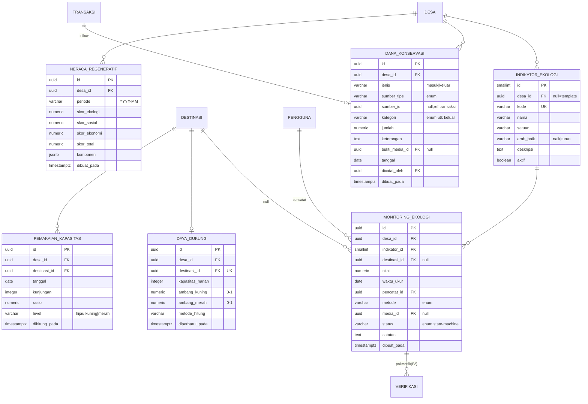
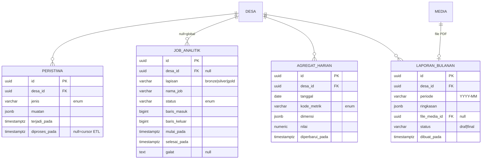

# ERD Fase 3 — Kiluan

**Cakupan:** **Jejak Lestari** (Regeneratif: indikator & monitoring ekologi, daya dukung, dana konservasi, Neraca Regeneratif) · **Anjungan Data** (Analitik: outbox peristiwa, medallion DuckDB, agregat gold, laporan bulanan).
**Bergantung pada F0–F2:** `desa`, `pengguna`, `destinasi`, `transaksi`, `booking`, `stempel`, `verifikasi`, `pengajuan_kartu`, `sertifikasi_owner`, `media`.
**Prinsip tetap:** multi-tenant, ledger append-only, enum di aplikasi + CHECK. **Analitik berat hidup di DuckDB + Parquet (MinIO); Postgres hanya menyimpan konfigurasi, ledger, dan agregat "gold" yang disajikan ke dashboard.**

---

## 1a. Diagram — Jejak Lestari (regeneratif)



## 1b. Diagram — Anjungan Data (analitik)



---

## 2. Perubahan lintas-fase

- `verifikasi.entitas_tipe` (F2) **+ `monitoring_ekologi`** → data warga tervalidasi lewat mekanisme yang sama (QR/foto/konfirmasi).
- **Validasi `pengajuan_kartu` (F1) dialihkan ke `verifikasi`** — Naik Kelas Lestari tak lagi bergantung persetujuan manual murni; bukti terverifikasi jadi syarat. Inilah titik "integritas regeneratif menguat".
- `destinasi.daya_dukung_harian` (slot F0) kini diperkaya oleh tabel `daya_dukung` (ambang + metode).
- `transaksi.porsi_reinvestasi` (F2) menjadi **inflow** `dana_konservasi`.

---

## 3. Spesifikasi tabel

### Jejak Lestari

**`indikator_ekologi`** — definisi indikator (template + kustom desa). `arah_baik` menentukan interpretasi skor (mis. `kesehatan_karang` naik = baik; `sampah_pantai` turun = baik). Contoh: `kesehatan_karang`, `populasi_lumba`, `tutupan_mangrove`, `mangrove_survival`, `sampah_terkumpul`.

**`monitoring_ekologi`** — pembacaan lapangan oleh warga/perangkat desa (PWA offline → sinkron). `metode`: `survei_lapangan | sensor | laporan_warga | pihak_ketiga`. `status` = **state machine** (§5): `menunggu_verifikasi | terverifikasi | ditolak`, divalidasi lewat `verifikasi`. **Data baseline Tahun 1–2 (konservasi) masuk lewat tabel ini.** Indeks `(desa_id, indikator_id, waktu_ukur)`, `(destinasi_id)`.

**`daya_dukung`** — konfigurasi kapasitas per destinasi (`UNIQUE(destinasi_id)`). `ambang_kuning`/`ambang_merah` (rasio 0–1) menentukan lampu peringatan.

**`pemakaian_kapasitas`** — snapshot harian hasil hitung: `kunjungan` (dari `booking` terkonfirmasi + check-in `stasiun_lestari`) ÷ `kapasitas_harian` → `rasio` → `level` (hijau/kuning/merah). `UNIQUE(destinasi_id, tanggal)`.

**`dana_konservasi`** — **ledger transparan** dua arah. `jenis`: `masuk | keluar`.
- Masuk: `sumber_tipe` = `transaksi | donasi | hibah | lainnya`; `sumber_id` → `transaksi` untuk inflow otomatis.
- Keluar: `kategori` = `rehabilitasi_karang | penanaman_mangrove | pengelolaan_sampah | edukasi | operasional | lainnya`; `bukti_media_id` wajib demi akuntabilitas.
- Saldo = `Σ(masuk) − Σ(keluar)` per desa. Indeks `(desa_id, tanggal, jenis)`.

**`neraca_regeneratif`** — skor gabungan periodik (bulanan), **KPI setara GMV**. `komponen` jsonb merinci: indikator ekologi (dari monitoring terverifikasi), distribusi pendapatan komunitas (dari `transaksi.neto_penyedia` per penyedia lokal), % adopsi regeneratif (dari `sertifikasi_owner`), rasio daya dukung. `skor_total` = agregasi berbobot tiga pilar.

### Anjungan Data

**`peristiwa`** — **outbox** append-only yang ditulis service domain (booking, transaksi, stempel, monitoring, dll). `diproses_pada` = kursor ETL inkremental. `jenis`: `booking_selesai | transaksi_settle | stempel_terverifikasi | monitoring_terverifikasi | kartu_tervalidasi | ...`. *(Alternatif: bronze menyalin langsung dari tabel transaksional; outbox dipilih untuk ETL inkremental yang bersih.)*

**`job_analitik`** — registry tiap run medallion. `lapisan`: `bronze | silver | gold`; `status`: `berjalan | sukses | gagal`. Untuk observabilitas & rekonsiliasi.

**`agregat_harian`** — **lapisan gold yang disajikan ke Postgres** (format panjang/narrow agar fleksibel). `kode_metrik`: `kunjungan | pendapatan | booking_selesai | transaksi_langsung | umkm_aktif | kontribusi | adopsi_regeneratif | booking_per_tingkat`. `dimensi` jsonb (mis. `{"umkm_id":...}` atau `{"tingkat":"lumba_lumba"}`). `UNIQUE(desa_id, tanggal, kode_metrik, dimensi)`. Dashboard ECharts/Plotly membaca dari sini (cepat); DuckDB untuk kueri ad-hoc.

**`laporan_bulanan`** — snapshot laporan (indikator "laporan bulanan tersedia"). `ringkasan` jsonb + ekspor PDF (`file_media_id`).

---

## 4. Enum F3

| Kolom | Nilai |
|---|---|
| `indikator_ekologi.arah_baik` | naik, turun |
| `monitoring_ekologi.metode` | survei_lapangan, sensor, laporan_warga, pihak_ketiga |
| `monitoring_ekologi.status` | menunggu_verifikasi, terverifikasi, ditolak |
| `pemakaian_kapasitas.level` | hijau, kuning, merah |
| `dana_konservasi.jenis` | masuk, keluar |
| `dana_konservasi.sumber_tipe` | transaksi, donasi, hibah, lainnya |
| `dana_konservasi.kategori` | rehabilitasi_karang, penanaman_mangrove, pengelolaan_sampah, edukasi, operasional, lainnya |
| `peristiwa.jenis` | booking_selesai, transaksi_settle, stempel_terverifikasi, monitoring_terverifikasi, kartu_tervalidasi, kontribusi_disetujui |
| `job_analitik.lapisan` | bronze, silver, gold |
| `job_analitik.status` | berjalan, sukses, gagal |
| `agregat_harian.kode_metrik` | kunjungan, pendapatan, booking_selesai, transaksi_langsung, umkm_aktif, kontribusi, adopsi_regeneratif, booking_per_tingkat |
| `laporan_bulanan.status` | draf, final |
| `verifikasi.entitas_tipe` *(diperluas)* | stempel, pengajuan_kartu, **monitoring_ekologi** |

---

## 5. State machine

**`monitoring_ekologi.status`:**
```
menunggu_verifikasi ──(verifikasi valid)──► terverifikasi   (→ dipakai di Neraca & agregat)
menunggu_verifikasi ──(verifikasi invalid)──► ditolak
```
Hanya monitoring `terverifikasi` yang masuk `neraca_regeneratif` & `agregat_harian`.

---

## 6. Mekanika turunan (inti F3)

**Alur medallion.** `peristiwa` (outbox) → **bronze** (Parquet mentah di MinIO) → **silver** (bersih + join dimensi) → **gold** → `agregat_harian` (Postgres) + `neraca_regeneratif`. Tiap tahap dicatat di `job_analitik`. DuckDB sebagai mesin baca Parquet; tak ada data warehouse berbayar.

**Peringatan daya dukung + umpan balik ke F2.** Job harian menghitung `pemakaian_kapasitas`; bila `level = merah`, Pokdarwis diperingatkan dan (opsional) pembuatan `booking` baru untuk spot itu pada tanggal tersebut diblokir di F2 — menutup lingkar ekowisata bertanggung jawab (kunjungan tak melampaui daya dukung).

**Dana konservasi otomatis + transparan.** `transaksi→settle` menulis `dana_konservasi(jenis=masuk, sumber=transaksi, jumlah=porsi_reinvestasi)`. Pengeluaran dicatat manual dengan `bukti_media_id`. Halaman transparansi publik membaca saldo & rincian — pembeda dari OTA.

**Anti-greenwashing (kunci).** `neraca_regeneratif` **tidak** memakai klaim mentah. Dampak yang di-stempel wisatawan (mis. `stempel.dampak = {mangrove:5}`) divalidasi silang terhadap `monitoring_ekologi` `mangrove_survival` terverifikasi. Klaim tanpa dukungan data monitoring tidak dihitung sebagai skor ekologi. Inilah yang membuat "regeneratif" terukur, bukan narasi.

**Nudge berbasis data untuk owner.** Job gold menghitung `booking_per_tingkat` (korelasi `sertifikasi_owner.tingkat` ↔ booking/rating) → `agregat_harian`. Dashboard owner menampilkan "listing tingkat Lumba-Lumba rata-rata X% lebih banyak booking" → insentif menerapkan praktik regeneratif jadi berbasis bukti.

---

## 7. Batas F3 (belum dibuat — sengaja)

- **F4:** provisioning tenant & tema/white-label (memperluas `pengaturan_desa`), ekspor/kepemilikan data per-desa, marketplace lintas-desa. Analitik & regeneratif menjadi per-tenant otomatis karena semua tabel sudah ber-`desa_id`.

---

## 8. Gerbang `pytest` F3

- Agregat gold == sumber transaksional (rekonsiliasi `agregat_harian` vs `transaksi`/`booking`).
- Saldo `dana_konservasi` = `Σ(masuk) − Σ(keluar)`; inflow = `Σ transaksi.porsi_reinvestasi`.
- `pemakaian_kapasitas.level` memicu di ambang benar (kuning/merah).
- (Opsional) booking baru diblokir saat spot berstatus merah pada tanggal itu.
- Hanya `monitoring_ekologi` terverifikasi yang masuk `neraca_regeneratif` & `agregat_harian`.
- Klaim dampak stempel tanpa dukungan monitoring tidak menaikkan skor ekologi.
- Outbox `peristiwa` diproses tepat-sekali (kursor `diproses_pada` idempoten; job ulang tak menggandakan agregat).
- `verifikasi` monitoring menolak pembacaan di luar geofence/tanpa bukti sesuai `syarat`.
- Semua agregat & neraca terpisah per `desa_id`.
