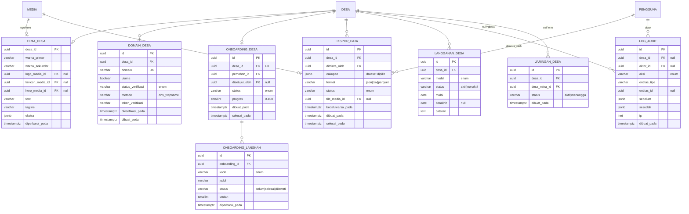

# ERD Fase 4 — Kiluan

**Cakupan:** **Nusantara** (Kemandirian & Replikasi): onboarding desa self-service, white-label (tema + domain kustom), kepemilikan & ekspor data, tata kelola/keberlanjutan, marketplace lintas-desa, hardening.
**Bergantung pada F0–F3:** `desa`, `pengguna`, `media`, `pengaturan_desa`, dan seluruh tabel domain (semuanya sudah ber-`desa_id`).
**Payoff arsitektur:** karena tenant tertanam sejak F0, replikasi = **membuat baris `desa` + seeding template**, tanpa migrasi skema.

---

## 1. Diagram ERD

---

## 2. Perubahan lintas-fase

- `pengaturan_desa` (F2) **+ `bahasa`/`zona_waktu`/`status_go_live`** (locale & flag rilis). Theming visual dipisah ke `tema_desa` agar `pengaturan_desa` tetap fokus pada operasional.
- `desa` (F0) `logo_media_id`/`warna_primer` menjadi **fallback**; sumber kebenaran branding kini `tema_desa`.

---

## 3. Spesifikasi tabel

**`tema_desa`** (1-1 dengan `desa`) — white-label: warna, logo, favicon, hero, font, tagline. `ekstra` jsonb untuk override kecil. Next.js me-resolve tema dari host request.

**`domain_desa`** — domain per desa (subdomain `*.sainsdataciv.com` otomatis atau domain kustom). `status_verifikasi`: `menunggu | terverifikasi | gagal` via `metode` (`dns_txt`/`cname`) + `token_verifikasi`. `utama` menandai domain kanonik. Flagship: `kiluan.sainsdataciv.com` (`utama=true`, terverifikasi).

**`onboarding_desa` + `onboarding_langkah`** — alur provisioning self-service. `langkah.kode`: `profil | tema | seed_konten | verifikasi_pokdarwis | pengaturan_reinvestasi | go_live`. `progres` diturunkan dari langkah selesai. `status`: `berjalan | selesai | tertunda`.

**`ekspor_data`** — **kepemilikan data komunitas**. Desa meminta ekspor seluruh data ber-`desa_id` (+ media) → bundle di MinIO (`file_media_id`), kedaluwarsa. `format`: `json | csv | parquet`; `status`: `antri | berjalan | selesai | gagal | kedaluwarsa`. Menegaskan platform = penatalayan, bukan pemilik.

**`langganan_desa`** — model keberlanjutan operasional. `model`: `gratis | disubsidi | mandiri` (bukan take-rate; sejalan community-owned). Ringan & bersifat tata kelola.

**`log_audit`** — hardening. Mencatat aksi sensitif (provisioning, ekspor, perubahan tema/domain, moderasi, login admin) dengan `sebelum`/`sesudah` jsonb + `ip`. `desa_id` null = aksi global.

**`jaringan_desa`** — kemitraan antar-desa untuk **marketplace lintas-desa** (promosi silang, paket gabungan). Relasi self many-to-many. Discovery lintas-desa sendiri adalah fitur baca di root `/` (agregasi destinasi/paket `publikasi` semua desa `aktif`) — tak butuh tabel baru.

---

## 4. Enum F4

| Kolom | Nilai |
|---|---|
| `domain_desa.status_verifikasi` | menunggu, terverifikasi, gagal |
| `domain_desa.metode` | dns_txt, cname |
| `onboarding_desa.status` | berjalan, selesai, tertunda |
| `onboarding_langkah.kode` | profil, tema, seed_konten, verifikasi_pokdarwis, pengaturan_reinvestasi, go_live |
| `onboarding_langkah.status` | belum, selesai, dilewati |
| `ekspor_data.format` | json, csv, parquet |
| `ekspor_data.status` | antri, berjalan, selesai, gagal, kedaluwarsa |
| `langganan_desa.model` | gratis, disubsidi, mandiri |
| `langganan_desa.status` | aktif, nonaktif |
| `log_audit.aksi` | buat, ubah, hapus, publikasi, moderasi, login, provisioning, ekspor, ubah_tema, ubah_domain |
| `jaringan_desa.status` | aktif, menunggu |

---

## 5. Mekanika turunan (inti F4)

**Provisioning desa baru (replikasi).**
1. Buat baris `desa` (status `draft`) + `onboarding_desa` dengan daftar `onboarding_langkah`.
2. **Seed dari template global** (baris ber-`desa_id = null`): `kategori`, `indikator_ekologi`, `kartu_aksi`, `misi`, `badge`, `aturan_poin` → di-scope ke desa bila perlu kustomisasi.
3. `tema_desa` default + `domain_desa` (subdomain otomatis / kustom terverifikasi).
4. Verifikasi Pokdarwis & `pengaturan_desa` (persen reinvestasi) diisi.
5. `go_live` → `desa.status = aktif`. **Tanpa migrasi skema** — inilah payoff tenancy F0.

**Resolusi white-label.** Middleware Next.js: host → `domain_desa` → `desa` → terapkan `tema_desa`. Rute `[desa]` tetap berlaku untuk path-based; domain kustom memetakan ke desa yang sama.

**Kepemilikan & ekspor.** `ekspor_data` job mengumpulkan semua baris ber-`desa_id` + media terkait → arsip di MinIO → tautan sementara. Desa bisa membawa datanya kapan saja.

**Hardening — nyalakan RLS sekarang.** Aktifkan **Row-Level Security per-desa** di seluruh tabel domain (janji sejak F0 §6): koneksi meng-set `app.desa_id`, kebijakan RLS memaksa filter tenant di level DB — pertahanan berlapis sebelum publik & multi-desa. Semua aksi sensitif menulis `log_audit`.

**Marketplace lintas-desa.** Discovery root `/` mengagregasi konten `publikasi` lintas desa `aktif`; `jaringan_desa` memungkinkan promosi silang & paket gabungan antar-desa mitra.

---

## 6. Gerbang `pytest` F4

- Provisioning desa baru menghasilkan tenant terisolasi; seed template lengkap; **tanpa perubahan skema**.
- **Isolasi RLS:** koneksi ber-`desa_id` A tak bisa membaca/menulis baris desa B (uji di level DB, bukan hanya aplikasi).
- Verifikasi domain (`dns_txt`/`cname`) hanya lolos dengan token benar; `utama` tunggal per desa.
- `ekspor_data` mencakup **seluruh** dataset ber-`desa_id` desa itu dan **tak membocorkan** desa lain; bundle bisa di-restore.
- Resolusi host → tema desa yang benar; domain kustom & subdomain memetakan ke desa sama.
- `log_audit` terisi untuk provisioning, ekspor, dan perubahan tema/domain.
- Discovery lintas-desa hanya menampilkan konten `publikasi` dari desa `aktif`.

---

## 7. Penutup — peta ERD lengkap Kiluan

| Fase | Modul | Tabel baru (kira-kira) |
|---|---|---|
| **F0** | Gerbang · Balai Warga · Destinasi Kiluan | 13 (tenancy, RBAC, destinasi, media) |
| **F1** | Pasar Desa · Dapur Konten · Lencana Warga · seed Naik Kelas Lestari | 14 (umkm, paket, kurasi, gamifikasi, kartu) |
| **F2** | Dermaga · Pemandu · Penjelajah Lestari | 18 (booking, transaksi, AI, misi/paspor/verifikasi) |
| **F3** | Anjungan Data · Jejak Lestari | 10 (monitoring, daya dukung, dana, neraca, analitik) |
| **F4** | Nusantara | 8 (tema, domain, onboarding, ekspor, audit) |

Seluruh skema konsisten: multi-tenant per-`desa_id`, RBAC via `keanggotaan`, ledger append-only (`transaksi`, `transaksi_poin`, `dana_konservasi`), state machine di `kurasi_log`/`verifikasi`, dan regeneratif tertanam sebagai domain model (bukan tempelan). Siap dijadikan rujukan Project Knowledge dan diterjemahkan ke kontrak API + scaffold + brief per fase.
