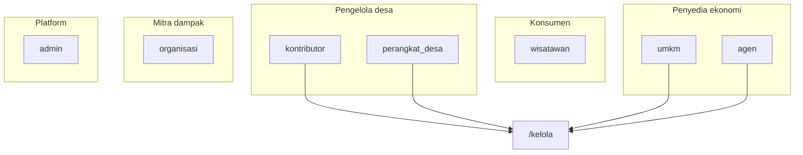

Setelah peleburan, kerangka **4 keluarga UI** perlu disesuaikan. `pokdarwis` sudah tidak ada sebagai peran; kapabilitasnya ada di **kontributor**, jadi kontributor sekarang **peran hibrida** (relawan + pengelola desa).

## Kerangka keluarga UI (revisi)

| Keluarga | Peran | Fokus UX | Shell utama |
|----------|-------|----------|-------------|
| **Konsumen** | `wisatawan` | Discovery, paspor, booking, wishlist | Etalase + `/paspor` + checkout |
| **Pengelola desa** | `kontributor` + `perangkat_desa` | Kurasi, keanggotaan, bendahara, validasi | `/kelola` + dasbor peran |
| **Penyedia ekonomi** | `umkm` + `agen` | Katalog, pesanan, pendapatan, slot/jadwal | `/saya/umkm`, `/kelola/pesanan`, dermaga |
| **Mitra dampak** | `organisasi` | Program konservasi, data ekologi, sponsor | Dasbor organisasi (F3) |
| **Platform** | `admin` | Lintas tenant, steward | `/admin/dasbor` |

**Perubahan utama:** kontributor **keluar** dari keluarga "Kontribusi & dampak" dan **masuk** ke "Pengelola desa". Organisasi sendirian di keluarga mitra dampak.

---

## Diferensiasi kontributor vs perangkat desa

Keduanya punya akses `/kelola` yang overlap, tapi **tone dan default** harus beda:

| Aspek | Kontributor | Perangkat desa |
|-------|-------------|----------------|
| Identitas | Relawan & kurator komunitas | Legitimasi pekon / tata kelola |
| Dasbor default | Kontribusi, lencana, leaderboard | Verifikasi, keanggotaan, transparansi |
| Tone copy | Partisipatif, gamifikasi | Formal, kebijakan & akuntabilitas |
| Aksi utama | Kontribusi baru, kurasi | Persetujuan keanggotaan, validasi kartu |
| Bendahara | Boleh (sama RBAC) | Boleh (otoritas lebih tinggi secara sosial) |

Praktis: **satu shell `/kelola`**, beda **landing dasbor** dan **urutan nav** per peran — seperti yang sudah ada di `dashboard-peran.ts`, tapi perlu dipoles agar tidak terasa "dasbor campur aduk".

---

## Rekomendasi prioritas desain (efisien)

### 1. Kontributor: dua zona dalam satu peran (prioritas tinggi)

Jangan tampilkan 12 nav sekaligus. Pecah dasbor kontributor jadi **dua zona mental**:

- **Zona Saya** — kontribusi, lencana, leaderboard, misi relawan  
- **Zona Kelola** — destinasi, kurasi, keanggotaan, bendahara, validasi  

Implementasi ringan: tab/segment di dasbor + CTA "Buka konsol kelola" ke `/kelola` (sudah ada redirect `operasional`).

### 2. Satu konsol `/kelola`, guard per zona (sudah ada — pertahankan)

`KelolaGuard` + `KelolaZonaGuard` sudah benar secara arsitektur. Yang perlu diperjelas di UI:

- Tab nav difilter per **kapabilitas**, bukan per **nama peran**
- Label tab pakai bahasa pengguna ("Kurasi", "Bendahara"), bukan kode RBAC

### 3. Pemilih peran: 5 kartu, bukan 7 (prioritas sedang)

Di `DasborHub`, pengguna multi-peran tidak perlu melihat nuansa teknis. Kelompokkan visual:

1. Wisatawan  
2. Kontributor & pengelola  
3. UMKM / Agen (bisa satu kartu "Bisnis lokal" jika user punya keduanya)  
4. Organisasi  
5. Perangkat desa  

Admin terpisah (link steward, bukan kartu desa).

### 4. Gabung komunitas: satu jalur pengelola (prioritas tinggi)

Wizard gabung sudah mengarah ke **kontributor** saja — pertahankan. Copy jelas:

> "Kontributor = sumbang data **dan** (setelah disetujui) ikut mengelola desa."

Hindari menawarkan "level" pengelola terpisah; eskalasi hak lewat **persetujuan keanggotaan**, bukan peran baru.

### 5. Organisasi vs kontributor: jangan dicampur di copy (prioritas sedang)

| Kontributor | Organisasi |
|-------------|--------------|
| Operasional harian desa | Program konservasi lintas program |
| Kurasi spot & konten wisatawan | Data ekologi, sponsor, laporan |
| Scoped ke satu desa | Mitra riset / NGO |

Di halaman Tentang & CTA beranda, dua peran ini harus terbaca berbeda (sudah dipisah di `tentang/page.tsx`).

### 6. Penyedia ekonomi: shared patterns (prioritas rendah–sedang)

UMKM dan agen share:

- Pola kartu pesanan/pendapatan  
- Status transaksi & escrow  
- Naik kelas / sertifikasi  

Agen tambahan: **slot, check-in, paket**. Bisa satu **design system "Penyedia"** dengan modul ekstra untuk agen.

### 7. Platform admin: jangan disatukan dengan desa-scoped (tetap)

`/admin/dasbor` tetap shell terpisah — beda header, tanpa konteks desa, tanpa nav `/kelola`.

---

## Yang tidak perlu dilakukan

- **Jangan** buat UI `pokdarwis` lagi — redirect URL lama sudah cukup  
- **Jangan** pecah kontributor jadi dua peran di RBAC — peleburan sudah selesai di backend  
- **Jangan** duplikasi halaman kelola per peran — satu `/kelola` + guard sudah tepat  

---

## Roadmap singkat (urutan kerja)

| Urutan | Item | Dampak |
|--------|------|--------|
| 1 | Dasbor kontributor: zona Saya / Kelola | Mengurangi kebingungan peran hibrida |
| 2 | Copy & i18n konsisten "Kontributor & pengelola" | Selaras dengan peleburan |
| 3 | Dasbor perangkat_desa: tone tata kelola | Beda dari kontributor meski akses sama |
| 4 | Pemilih peran dikelompokkan (5 kartu) | Onboarding multi-peran lebih ringkas |
| 5 | Design system Penyedia (UMKM + agen) | Efisiensi dev F2/F3 |
| 6 | Dasbor organisasi (F3 placeholder → nyata) | Keluarga mitra dampak hidup |

---

**Intinya:** setelah peleburan, desain tidak lagi "8 peran" melainkan **5 keluarga pengalaman**. Kontributor adalah pengelola desa versi komunitas; perangkat desa adalah pengelola versi pemerintah desa; organisasi tetap mitra dampak terpisah.

Kalau mau, langkah implementasi berikutnya bisa langsung **refactor dasbor kontributor jadi dua zona (Saya / Kelola)** — itu dampak UX terbesar dengan diff paling kecil.