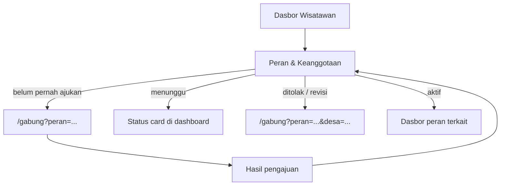

Ini pola yang paling selaras dengan arsitektur yang sudah ada (`/gabung`, `akun#keanggotaan`, dasbor multi-peran) dan dengan brief dashboard.

## Prinsip utama

**Pisahkan dua fungsi:**

| Fungsi | Tempat | Alasan |
|--------|--------|--------|
| **Mengisi / submit pengajuan** | Rute global onboarding | Form panjang, stepper, pilih desa — cocok di halaman khusus |
| **Melihat status & memutuskan langkah berikutnya** | Dasbor wisatawan | Ringkas, kontekstual, tanpa duplikasi form |

Jadi: **form tidak perlu ada di dashboard**, tapi **status pengajuan harus terlihat di dashboard**.

---

## Alur yang disarankan



### 1. Pengajuan pertama kali → selalu rute global

Kalau user **belum pernah** mengajukan peran tertentu:

- **Kontributor / UMKM / Agen** → `/gabung?peran=kontributor` (atau `umkm`, `agen`)
- **Organisasi** → rute global terpisah, mis. `/gabung/organisasi` (belum ada di `PERAN_GABUNG` sekarang, tapi konsepnya sama)

Wizard `/gabung` yang sudah ada tetap dipakai; cukup perkaya entry point dari dashboard dengan query param supaya langsung ke langkah yang tepat.

### 2. Pengajuan kedua / peran tambahan → tetap `/gabung`, beda entry

User sudah kontributor, mau jadi UMKM di desa lain:

- Dari dashboard: **"Tambah peran baru"** → `/gabung` (stepper skip wisatawan karena sudah aktif)
- Bukan form baru di dashboard — **satu wizard, banyak entry**

Ini sudah selaras dengan `GabungKomunitasClient` yang cek `statusKeanggotaan` per peran.

### 3. Manajemen status → di dasbor wisatawan

Tambahkan satu zona/nav di dasbor wisatawan:

**`Peran & keanggotaan`** (`/dasbor/wisatawan/peran` atau section di ringkasan)

Isinya kartu per peran yang relevan (kontributor, UMKM, agen, organisasi):

| Status | Tampilan di dashboard | Aksi |
|--------|----------------------|------|
| Belum pernah ajukan | Empty state + penjelasan singkat | **Ajukan** → `/gabung?peran=X` |
| `menunggu` | Badge amber + "Sedang ditinjau pengelola desa" | Tidak ada form — cukup pantau |
| `revisi` / `ditolak` | Badge merah + arahan singkat | **Submit ulang** → `/gabung?peran=X&desa=Y` |
| `aktif` | Badge hijau | **Buka dasbor [peran]** → `/dasbor/kontributor` dll. |

### 4. `/saya/akun#keanggotaan` — tetap ada, peran berbeda

- **Dashboard** = ringkasan actionable (CTA ajukan / buka dasbor)
- **Akun** = daftar lengkap + detail teknis (desa_id, semua riwayat)

Duplikasi ringan di sini wajar; dashboard fokus aksi, akun fokus pengaturan.

---

## Navigasi wisatawan (revisi)

```
Ringkasan
Jelajah desa
Wishlist
Paspor Lestari
Pesanan saya
─────────────────
Peran & keanggotaan   ← baru (status + ajukan peran)
Akun & preferensi
```

Poin & lencana bisa tetap di widget ringkasan, tidak perlu item nav terpisah dulu.

---

## Yang **tidak** perlu dilakukan

- Form onboarding penuh di dalam shell dashboard
- Duplikasi wizard `/gabung` per peran (cukup query param + copy berbeda)
- Arahkan ke dasbor kontributor/UMKM sebelum keanggotaan `aktif` (guard sudah benar)

---

## Ringkas jawaban pertanyaan Anda

> Kalau begini bagusnya diarahkan kemana?

| Situasi | Arah |
|---------|------|
| Belum pernah daftar peran X | **Rute global** `/gabung?peran=X` |
| Sudah pernah, mau peran tambahan | **Rute global** `/gabung` (dari dashboard: "Tambah peran") |
| Lihat status pengajuan | **Dashboard wisatawan** → Peran & keanggotaan |
| Revisi / ditolak | **Rute global** dengan param prefilled |
| Sudah aktif | **Dasbor peran** masing-masing |

---

Kalau setuju dengan pola ini, langkah implementasi berikutnya yang paling kecil tapi berdampak:

1. Tambah nav **Peran & keanggotaan** di `konfigDasborWisatawan`
2. Buat halaman/section dengan kartu status dari `user.profil.keanggotaan`
3. CTA smart: belum ada → `/gabung?peran=...`, pending → info saja, aktif → `dasborHref`, ditolak → `/gabung?...`

Mau saya lanjut implement poin 1–3?